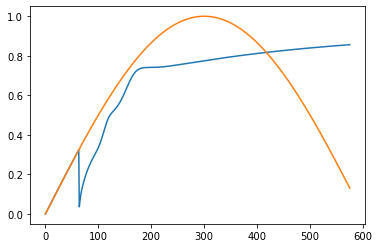
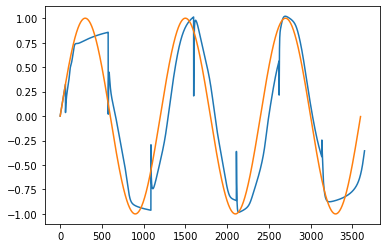

# HAPI-NN
Tool for training and applying Neural Networks with HAPI

## Setup
Import HAPI and other packages


```python
from hapiclient import hapi, hapitime2datetime
from hapiplot import hapiplot
from hapi_nn import HAPINNTrainer, HAPINNTester
import hapi_nn
import numpy as np
import matplotlib.pyplot as plt
%matplotlib inline
```

### HAPI Setup
Set HAPI related parameters


```python
hapi_nn.MODEL_ENGINE = 'TENSORFLOW'

server     = 'http://hapi-server.org/servers/TestData2.0/hapi'
dataset    = 'dataset1'
start = '1970-01-01T00:02:00Z'
stop = '1970-01-01T10:00:00Z'

start2 = '1970-01-01T01:00:00Z'
stop2 = '1970-01-01T02:00:00Z'

parameters = 'scalar'
y_parameters = 'scalar'
options = {'logging': True, 'usecache': True, 'cachedir': './hapicache'}
```

## HAPI-NN Testing
Begin testing HAPI-NN


```python
in_steps = 64
out_steps = 512
```

### Create Trainer and Tester as well as load data with HAPI

Create Trainer


```python
def preprocess(x):
    means = x.mean(axis=0)
    stds = x.std(axis=0)
    return (x - means) / stds
    
splits = [.7, .2, .1]  # Train, Validation, Test
    
t = HAPINNTrainer(
    splits, in_steps, out_steps,
    preprocess_func=None,  #preprocess
    lag=True
)
```

Load data for Training


```python
data, meta = hapi(server, dataset, parameters, start, stop, **options)
#hapiplot(data, meta, **options)
t.set_hapidatas([data], xyparameters=[parameters.split(','), y_parameters.split(',')])
```

    hapi(): Running hapi.py version 0.2.4
    hapi(): file directory = ./hapicache/hapi-server.org_servers_TestData2.0_hapi
    hapi(): Reading dataset1_scalar_19700101T000200_19700101T100000.pkl
    hapi(): Reading dataset1_scalar_19700101T000200_19700101T100000.npy 


Prepare the downloaded data for training


```python
t.prepare_data()
```

Test saving and loading


```python
t.save_prepared_data('data')
```


```python
t.load_prepared_data('./data')
```

Create Tester


```python
def preprocess(x):
    return x
    
tester = HAPINNTester(
    in_steps, out_steps, preprocess_func=None  #preprocess
)
```

Load data for testing


```python
data, meta = hapi(server, dataset, parameters, start2, stop2, **options)
#data2, meta = hapi(server, dataset, y_parameters, start2, stop2, **options)
tester.set_hapidatas([data], xyparameters=[parameters.split(','), y_parameters.split(',')])
```

    hapi(): Running hapi.py version 0.2.4
    hapi(): file directory = ./hapicache/hapi-server.org_servers_TestData2.0_hapi
    hapi(): Reading dataset1_scalar_19700101T010000_19700101T020000.pkl
    hapi(): Reading dataset1_scalar_19700101T010000_19700101T020000.npy 


Prepare data for testing


```python
tester.prepare_data()
```

### Create Models and Train

Import either the modules for PyTorch or TensorFlow


```python
if hapi_nn.MODEL_ENGINE == 'TORCH':
    import torch
    import torch.nn as nn
    from torch.utils.data import TensorDataset, DataLoader
else:
    import tensorflow as tf
    from tensorflow import keras
```

Create PyTorch Module or TensorFlow Model


```python
if hapi_nn.MODEL_ENGINE == 'TORCH':
    class S2S(nn.Module):
        def __init__(self, num_sensors, hidden_units):
            super().__init__()
            self.num_sensors = num_sensors  # this is the number of features
            self.hidden_units = hidden_units
            self.num_layers = 2

            self.lstm_en = nn.LSTM(
                input_size=num_sensors,
                hidden_size=hidden_units,
                batch_first=True,
                num_layers=self.num_layers
            )

            self.lstm_de = nn.LSTM(
                input_size=hidden_units,
                hidden_size=hidden_units,
                batch_first=True,
                num_layers=self.num_layers
            )

            self.conv = nn.Conv1d(hidden_units, num_sensors, 1, stride=1)

        def forward(self, x):
            batch_size = x.shape[0]
            h0_en = torch.zeros(self.num_layers, batch_size, self.hidden_units).requires_grad_()
            c0_en = torch.zeros(self.num_layers, batch_size, self.hidden_units).requires_grad_()
            h0_de = torch.zeros(self.num_layers, batch_size, self.hidden_units).requires_grad_()
            c0_de = torch.zeros(self.num_layers, batch_size, self.hidden_units).requires_grad_()

            output, (hn, _) = self.lstm_en(x, (h0_en, c0_en))
            x = hn[-1] # last layer, last hidden state
            x = x.unsqueeze(1).repeat(1, out_steps, 1) #output.shape[1]

            output, (hn, _) = self.lstm_de(x, (h0_de, c0_de))

            output = torch.swapaxes(output, 1, 2)

            output = self.conv(output)

            output = torch.swapaxes(output, 1, 2)

            return output
        
    model = S2S(1, 64)
    loss_function = nn.MSELoss()
    optimizer = torch.optim.Adam(model.parameters(), lr=0.001)
    device = 'cpu'
    print(model)
else:
    x0 = keras.layers.Input(shape=(in_steps, 1))
    x = keras.layers.LSTM(64, return_sequences=True)(x0)
    x = keras.layers.LSTM(64)(x)
    x = keras.layers.RepeatVector(out_steps)(x)
    x = keras.layers.LSTM(64, return_sequences=True)(x)
    x = keras.layers.Conv1D(1, 1, strides=1)(x)

    model = keras.models.Model(inputs=x0, outputs=x)
    model.summary()

    optimizer = keras.optimizers.Adam(lr=.001)
    model.compile(loss='mse', optimizer=optimizer)
    
    device = None
    loss_function = None
    optimizer = None
```

    2022-06-20 17:51:40.571725: I tensorflow/core/platform/cpu_feature_guard.cc:151] This TensorFlow binary is optimized with oneAPI Deep Neural Network Library (oneDNN) to use the following CPU instructions in performance-critical operations:  SSE4.1 SSE4.2 AVX AVX2 FMA
    To enable them in other operations, rebuild TensorFlow with the appropriate compiler flags.


    Model: "model"
    _________________________________________________________________
     Layer (type)                Output Shape              Param #   
    =================================================================
     input_1 (InputLayer)        [(None, 64, 1)]           0         
                                                                     
     lstm (LSTM)                 (None, 64, 64)            16896     
                                                                     
     lstm_1 (LSTM)               (None, 64)                33024     
                                                                     
     repeat_vector (RepeatVector  (None, 512, 64)          0         
     )                                                               
                                                                     
     lstm_2 (LSTM)               (None, 512, 64)           33024     
                                                                     
     conv1d (Conv1D)             (None, 512, 1)            65        
                                                                     
    =================================================================
    Total params: 83,009
    Trainable params: 83,009
    Non-trainable params: 0
    _________________________________________________________________


### Train the model


```python
epochs = 4
batch_size = 32

t.train(model, epochs, batch_size=batch_size, loss_func=loss_function,
        optimizer=optimizer, device=device)
```

    Epoch 1/4
    773/773 [==============================] - 320s 408ms/step - loss: 0.3008 - val_loss: 0.3544
    Epoch 2/4
    773/773 [==============================] - 342s 442ms/step - loss: 0.3235 - val_loss: 0.2971
    Epoch 3/4
    773/773 [==============================] - 340s 440ms/step - loss: 0.1714 - val_loss: 0.0247
    Epoch 4/4
    773/773 [==============================] - 347s 449ms/step - loss: 0.0136 - val_loss: 0.0127


    {'train': 0.012974596582353115,
     'val': 0.01269221305847168,
     'test': 0.012647946365177631}


### Test Model

Predict all forecasts over the downloaded testing data using the default stride (out_steps)


```python
predictions = tester.test(model)
```

Since forecasting, skipping normal plot


```python
#tester.plot(predictions, 0, 'scalar')
```


```python
tester.forecast_plot(predictions, 0, 'scalar')
```


    

    


Create full plot from predictions. Note, each prediction still restarts with the default stride. Also, the first part of the prediction on plots includes the ground truth for the length of in_steps


```python
#tester.plot(predictions, -1, 'scalar')
```


```python
tester.forecast_plot(predictions, -1, 'scalar')
```


    

    


```python

```
